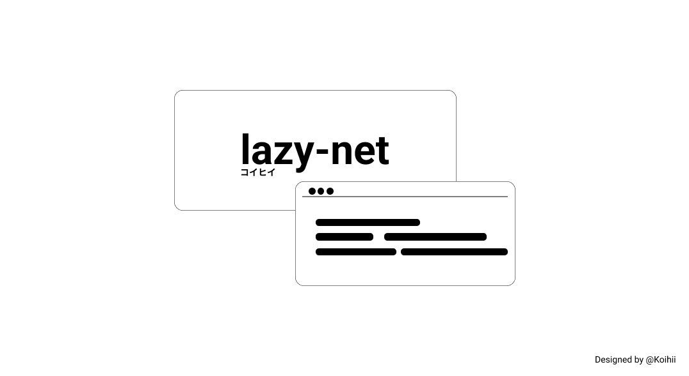
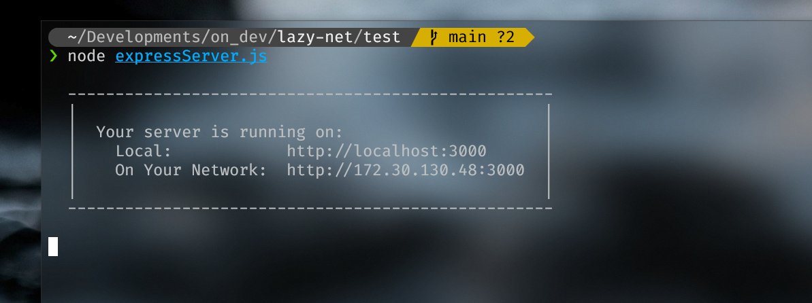
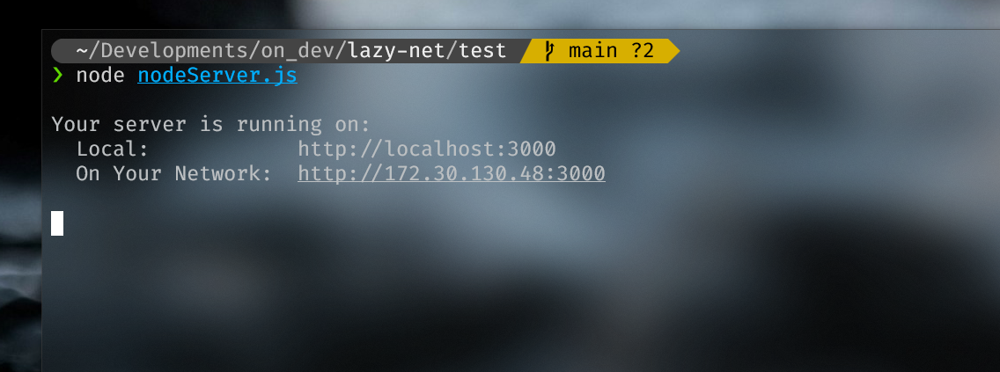

# lazy-net



A simple, lightweight plugin for printing local network when starting [Node.js](https://nodejs.org/en/) or [Express.js](https://expressjs.com/) server. I made this so you don't have to.

There are currently 2 options for this module.

With outline.


No outline.


## Installation

Before installing this module, you have to:

- [Download and install Node.js](https://nodejs.org/en/download). If you're in `Linux platform`.

```bash
$ npm install nodejs
```

After that, simply install this module by using this command:

```bash
$ npm install @koihii/lazy-net
```

## Usage

`lazy-net` supports both `ESModule` and `CommonJS`. You can either:

```js
// with commonjs.
const lazyNet = require('@koihii/lazy-net');

// with esmodule.
import lazyNet from ('@koihii/lazy-net');
```

When dealing with [Node.js](https://nodejs.org/en/) server.

```js
const http = require("http");
const lazyNet = require("@koihii/lazy-net");

const port = process.env.PORT || 3000;

const server = http.createServer((req, res) => {
  res.writeHead(200, { "Content-Type": "application/json" });
  res.write("Server's starting with Node.JS");
  res.end();
});

server.listen(port, (error) => {
  if (error) throw error;
  layNet(port);
  // lazyNet(port, true) 'if you want to print outline'.
});
```

Before using with [Express.js](https://expressjs.com) server. You must [install Express.js](https://expressjs.com/en/starter/installing.html) framework first by using this command:

```bash
$ npm install express
```

```js
const express = require("express");
const app = express();

const port = process.env.PORT || 3000;

app.get("/", (req, res) => {
  res.send("Server's starting with Express.js");
});

app.listen(port, () => {
  layNet(port);
  // lazyNet(port, true) 'if you want to print outline'.
});
```

Follow [this link](https://github.com/Koihii/lazy-net/tree/main/test) to see sample files.

## Credits

`lazy-net` is created because I'm tired to create a same piece of code again and again.

## License

[MIT](LICENSE)
